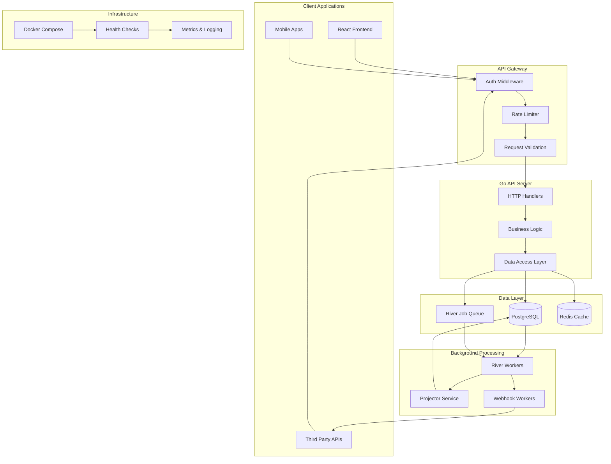
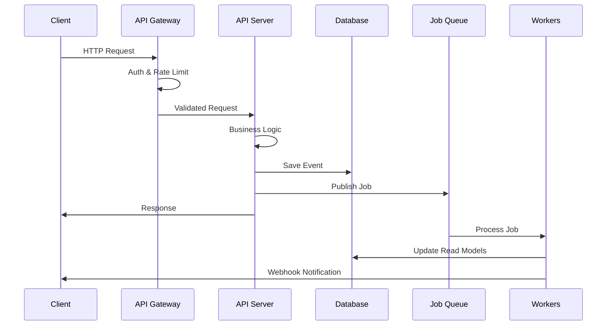

# LedaaS - Ledger as a Service

A modern double-entry bookkeeping system built with Go and React.

## Features

- Double-Entry Accounting - Ensures balanced debits and credits
- Event Sourcing - Complete audit trail with immutable events
- High Performance - Built with Go, PostgreSQL, and optimized queries
- Real-time Processing - Job queue with River for background tasks
- API Keys & Authentication - Secure API access with JWT
- RESTful API - Clean and well-documented endpoints
- Integration Tests - Testcontainers for reliable testing
- Docker Support - Full containerization with health checks

## Architecture



### Data Flow



## Quick Start

### Prerequisites
- Docker & Docker Compose
- Node.js 20+ (for local development)

### Running with Docker

```bash
# Start all services
docker compose up -d --build

# Check status
docker compose ps

# View logs
docker compose logs -f
```

Services will be available at:
- API: http://localhost:8080
- Web: http://localhost:5173
- PostgreSQL: localhost:5432

### Development

```bash
# Start backend services
docker compose up -d postgres worker

# Run API locally
go run ./cmd/api

# Run web frontend
cd web && npm run dev
```

## API Documentation

### Health Check
```bash
curl http://localhost:8080/health
```

### Authentication
All API endpoints require valid API keys or JWT tokens.

### Core Endpoints
- `POST /transactions` - Create new transactions
- `GET /ledgers/{id}/balance` - Get account balances
- `GET /events` - Query event history

## Testing

```bash
# Run integration tests
docker compose --profile test up test

# Run unit tests
go test ./...
```

## Project Structure

```
LedaaS/
├── cmd/                 # Application entry points
│   ├── api/            # API server
│   ├── worker/         # Background job processor
│   └── migrate/        # Database migrations
├── internal/           # Private application code
│   ├── integration/    # Integration tests
│   ├── ledger/         # Core ledger logic
│   └── webhook/        # Webhook handling
├── migrations/         # SQL migration files
├── web/               # React frontend
└── docker-compose.yml # Service orchestration
```

## Database Schema

The system uses event sourcing with the following key tables:
- `events` - Immutable source of truth
- `accounts` - Current account balances
- `transactions` - Processed transactions
- `river_job` - Background job queue

## Contributing

1. Fork the repository
2. Create a feature branch
3. Add tests for new functionality
4. Ensure all tests pass
5. Submit a pull request

## License

MIT License - see LICENSE file for details.
