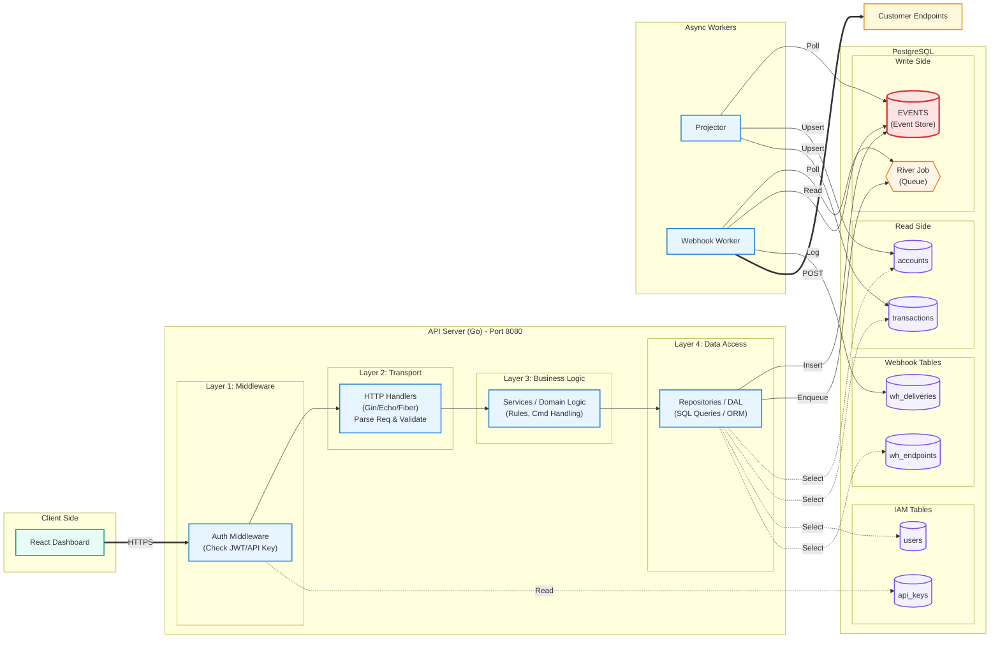

# LedaaS - Ledger as a Service

A modern double-entry bookkeeping system built with Go and React.

## Features

- Double-Entry Accounting - Ensures balanced debits and credits
- Event Sourcing - Complete audit trail with immutable events
- High Performance - Built with Go, PostgreSQL, and optimized queries
- Real-time Processing - Job queue with River for background tasks
- API Keys & Authentication - Secure API access with JWT
- RESTful API - Clean and well-documented endpoints
- Integration Tests - Testcontainers for reliable testing
- Docker Support - Full containerization with health checks

## Architecture



## Quick Start

### Prerequisites
- Docker & Docker Compose
- Node.js 20+ (for local development)

### Running with Docker

```bash
# Start all services
docker compose up -d --build

# Run web frontend
cd web && npm run dev
```

Services will be available at:
- API: http://localhost:8080
- PostgreSQL: localhost:5432

## Project Structure

```
LedaaS/
├── cmd/                 # Application entry points
│   ├── api/            # API server
│   ├── migrate/        # Database migrations
│   ├── test-runner/    # Integration test runner
│   └── worker/         # Background job processor
├── internal/           # Private application code
│   ├── api/            # API routes and handlers
│   ├── auth/           # Authentication & middleware
│   ├── config/         # Configuration management
│   ├── dashboard/      # Dashboard handlers
│   ├── db/             # Database connections
│   ├── integration/    # Integration tests
│   ├── ledger/         # Core ledger logic
│   ├── projector/      # Event projection service
│   └── webhook/        # Webhook handling
├── web/               # React frontend (gitignored)

```

## Database Schema

The system uses event sourcing with the following key tables:

### Identity & Access Management
- `users` - User accounts
- `organizations` - Organization management
- `org_users` - User-organization relationships
- `projects` - Project management
- `ledgers` - Ledger definitions
- `api_keys` - API authentication keys

### Event Sourcing Core
- `events` - Immutable source of truth storing all ledger events
- `accounts` - Current account balances (read model)
- `transactions` - Transaction records (read model)
- `postings` - Double-entry postings (read model)
- `projector_offsets` - Event projector tracking

### Webhook System
- `webhook_endpoints` - Webhook endpoint configurations
- `webhook_deliveries` - Webhook delivery logs and retry status
